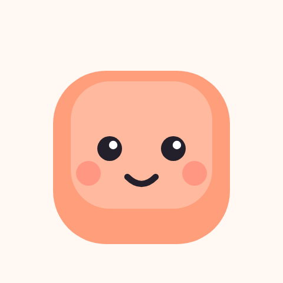
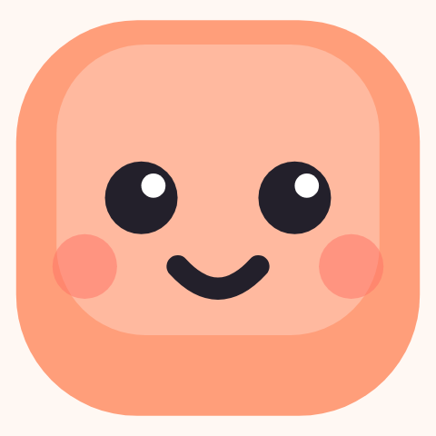
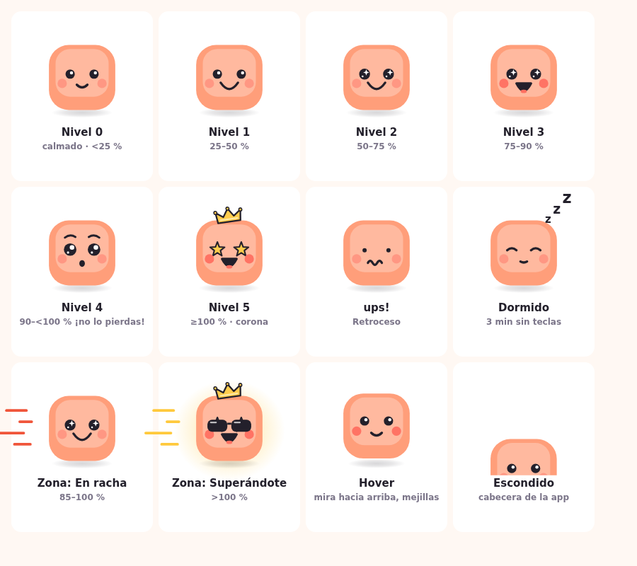

# Tapomo, el personaje: biblia de personaje

Guía para diseñadores y futuros colaboradores. **La fuente de verdad es el código**: cada cifra de este documento sale de un fichero concreto (indicado entre paréntesis) y, si el código cambia, el código manda. Los identificadores técnicos (clases CSS, funciones, claves de i18n) se dejan tal cual están en el código.

Lema: **«Cada tecla cuenta»**.

## Índice

1. Identidad y personalidad
2. Paleta
3. Anatomía y proporciones
4. Expresiones
5. Animaciones
6. Reglas de comportamiento
7. Cómo ver las animaciones
8. Do / Don't para nuevo arte y accesorios

---

## 1. Identidad y personalidad

**Quién es.** Tapomo es una tecla de teclado blandita, tipo mochi, de color melocotón (`#ff9e7a`), con cara. Es la mascota de la app Tapomo (medidor de velocidad de escritura para Windows, Tauri v2, tapomo.app) y vive en dos sitios: la cabecera de la ventana principal (76 px, `ui/mascot.css`) y una ventana flotante propia sobre el escritorio (120 px dentro de una ventana de 210×210, `ui/pet.css`, `src-tauri/src/pet.rs`).

**Qué hace.** Reacciona a lo que escribes: rebota más cuanto más rápido vas, cambia de cara según lo cerca que estás de tu propio récord de racha sin borrar, se pone gafas de sol cuando superas tu ritmo habitual y se duerme cuando paras. Nunca ve qué tecla pulsas, solo su clase (`char`, `space`, `enter`, `delete`, `word_delete`; `ui/pet.js`, cabecera del fichero).

**Carácter.**

- Siempre positivo. No regaña, no juzga, no compara en negativo. Si borras, hace «¡ups!» con una ladeada de cabeza de 460 ms y sigue; no hay cara triste ni enfadada en todo el código.
- Celebra las victorias pequeñas: una racha un poco más larga, subir de zona, una hora buena. Las celebraciones escalan (estrellitas pequeñas, medianas, completas), pero nunca se burlan de la ausencia de ellas.
- Compañero, no entrenador. Su ritmo de referencia es el tuyo (percentil 90 de tus picos de 10 s de los últimos 30 días, `crates/tapomo-core/src/lib.rs`), nunca el de otras personas ni una meta ajena.
- Discreto. Nunca roba el foco, los clics lo atraviesan salvo sobre su cuerpo, se esconde con apps a pantalla completa y puede esconderse una hora (sección 6).
- Honesto con la privacidad: «Nunca guardo lo que escribes, solo cuento teclas».

**Voz.** Frases cortas, tuteo, minúsculas y exclamaciones en las reacciones («¡ups!», «¡hola!»), frases algo más largas y cálidas en los consejos. Un emoji ocasional (🚀, 🙈), nunca más de uno por frase. Los números siguen el idioma (ES: `12.345` y `0,5`, unidad «ppm»; EN: `12,345` y `0.5`, unidad «WPM»; `src-tauri/src/pet_tip.rs`, función `num`).

Reacciones (de `ui/locales/es.json` y `en.json`):

| Clave | ES | EN | Cuándo |
|---|---|---|---|
| `pet.hi` | ¡hola! | hi! | despierta al teclear tras dormir (1000 ms) |
| `pet.oops` | ¡ups! | oops! | borrar un carácter (900 ms) |
| `pet.oops_big` | ¡uuups! | ooooops! | borrar una palabra, `word_delete` (900 ms, texto grande) |
| `pet.record` | ¡Nuevo récord! | New record! | rompe su récord de racha (2200 ms, texto grande) |
| `pet.here` | ¡aquí estoy! | here I am! | reaparece tras estar escondido (2500 ms) |
| `pet.hint` | Clic: te digo algo · Doble clic: abrir · Botón derecho: más | Click: say something · Double-click: open · Right-click: more | pista al pasar el ratón, solo las 3 primeras veces |

Consejos al hacer clic (clave `tip.*`; todos positivos):

- «¡Hoy tu mejor racha es de {n} caracteres sin borrar!» / «Today your best streak is {n} characters without deleting!»
- «Hoy escribes un {p} % más rápido de lo habitual 🚀» / «You're typing {p}% faster than usual today 🚀»
- «Solo corriges un {p} % de lo que escribes. ¡Muy bien!» / «You only correct {p}% of what you type. Nicely done!»
- «Tu pico de hoy ({w} {u}) está a solo {d} {u} de tu récord» / «Today's peak ({w} {u}) is just {d} {u} from your record»
- «¡Hoy has batido tu récord de velocidad: {w} {u}!» / «You beat your speed record today: {w} {u}!»
- «Tu mejor hora suele ser las {h}:00. ¡Aprovéchala!» / «Your best hour is usually {h}:00. Make the most of it!»
- «Hoy llevas {n} caracteres: ¡unas {pages} páginas!» / «{n} characters so far today: about {pages} pages!»
- «Donde más rápido escribes es en {app}» / «You type fastest in {app}»
- «Sigue escribiendo: estoy aprendiendo tu ritmo ({have}/{need})» / «Keep typing: I'm learning your pace ({have}/{need})»
- «¡Hola! Hoy aún no hemos escrito nada juntos» / «Hi! We haven't typed anything together yet today»
- «Las pausas para pensar no cuentan: escribe a tu ritmo» / «Thinking pauses don't count: type at your own pace»
- «Si te molesto, puedes esconderme desde la bandeja» / «If I get in the way, you can hide me from the tray»
- «Nunca guardo lo que escribes, solo cuento teclas» / «I never save what you type, I only count keys»

Etiquetas de zona (`zone.*`): «Calentando», «Buen ritmo», «¡En racha!», «¡Superándote!» / en EN las equivalentes del fichero `en.json`.

Texto cuando está escondido (`pet.hide.*`): «Estoy escondido 🙈», «Vuelvo en {m} min», «Me he escondido mientras ves algo a pantalla completa»; botones «¡Sal!» y «¡Sal ya!».

---

## 2. Paleta

Colores del personaje (`assets/tapomo.svg`, `ui/mascot.js`, `ui/mascot.css`):

| Rol | Hex | Dónde |
|---|---|---|
| Cuerpo (melocotón) | `#ff9e7a` | `rect` principal del cuerpo |
| Brillo del cuerpo | `#ffffff` al `opacity .28` | `rect` interior (queda aprox. `#ffb69b` sobre el cuerpo) |
| Tinta | `#23202b` | ojos, boca, cejas, contornos de corona y estrellas, sombra, gafas, «z» |
| Reflejos de ojos | `#ffffff` | puntos y estrellitas dentro de los ojos |
| Mejillas | `#ff6f61` | `opacity .45` en reposo (en el SVG estático); `.cheek` en `mascot.css` pasa a `.95` con `blush` o `hover` |
| Lengua (boca abierta) | `#ff6f61` | elipse dentro de `mouth-open` |
| Oro (corona, estrellas de ojos, destellos) | `#ffcc4d` | corona y `goldStar`; contorno `#23202b` |
| Oro de destellos y brillo | `#ffc93c` | estrellas del `burstStars` (dos de cada tres; la tercera `#fff`), resplandor `m-glow-grad` (`stop-opacity` .55 / .22 / 0) |
| Brillo de la corona | `#fff3c4` | línea `M67 38 H93`, `opacity .8` |
| Sombra de suelo | `#23202b` | degradado radial `m-shadow-grad`, `stop-opacity` .18 / .11 / 0 (offsets 0 / .55 / 1) |
| Reflejo de las gafas | `#ffffff` | `opacity .7` |

Colores de zona (`ui/style.css` `--zone-*`, `ui/pet.css` barra viva, `ui/mascot.css` líneas de velocidad):

| Zona | Rango (% de tu referencia) | Barra / `--zone-*` | Texto (`--zone-text`) | Líneas de velocidad |
|---|---|---|---|---|
| `warming` Calentando | < 60 % | `#b7b0c4` | `--muted` (`#7b7589` claro, `#a39cb3` oscuro) | ninguna |
| `good` Buen ritmo | 60 – < 85 % | `#ff9e7a` | `--accent-strong` `#f0764a` | ninguna |
| `fire` ¡En racha! | 85 – 100 % | `#f0553a` | `#e0462c` | `#f0553a` |
| `beating` ¡Superándote! | > 100 % | `#ffc93c` | `#b07d00` | `#ffc93c` (más resplandor y gafas) |

Las líneas de velocidad de `fire` y `beating` tienen color propio en `mascot.css`; en `good` el trazo base sería `#ff9e7a`, pero el grupo está oculto (opacidad 0) fuera de `fire` y `beating`.

Barra en calibración (`ui/pet.css`): fondo `#d9d3e3`, rayas `#8f87a1` / `#cfc8dd` (6 px cada una, ángulo −45°).

Tema de la app (`ui/style.css`): `--accent #ff9e7a`, `--accent-strong #f0764a`, `--ink #23202b`, `--bg #fff8f3`, `--card #ffffff`, `--muted #7b7589`, `--line #f0e4dc`, `--cell-empty #f6eee8`, `--muted-fill #b7b0c4`. En modo oscuro (`prefers-color-scheme: dark`): `--ink #f5eefb`, `--bg #1b1822`, `--card #26222f`, `--muted #a39cb3`, `--line #38323f`, `--cell-empty #302b39`.

**Claro y oscuro.**

- El personaje **no cambia de color** entre temas: melocotón, tinta y oro son los mismos. Funciona porque el cuerpo es claro y opaco y la cara va dentro de él.
- Lo que sí cambia es lo que hay detrás: la sombra de suelo (tinta con 18 % de opacidad) se ve menos sobre `#1b1822`, y las «z» del sueño y las líneas de velocidad `fire` quedan fuera del cuerpo. Las «z» usan la tinta `#23202b` con un contorno crema `#fff8f3` de 3 px (`paint-order: stroke`, `ui/mascot.css`), así se leen sobre escritorios claros y oscuros.
- La burbuja de diálogo es siempre blanca `#fff` con texto `#23202b` (`ui/pet.css`), porque la ventana flotante es transparente y vive sobre cualquier fondo del escritorio.
- El laboratorio (`ui/lab.html`) tiene casilla «Dark background» (`#1b1822`) para comprobar ambos casos.

---

## 3. Anatomía y proporciones

Todo se define en el `viewBox="0 0 160 160"` de `assets/tapomo.svg` (se renderiza a 160×160) y en la plantilla `markup` de `ui/mascot.js`, que usa exactamente la misma geometría.

### Cuerpo (la tecla)

| Parte | Valores SVG | Proporción |
|---|---|---|
| Cuerpo | `rect x=30 y=40 width=100 height=98 rx=30` | 62,5 % × 61,3 % del lienzo; casi cuadrado (100 × 98); esquinas de radio 30 = 30 % del ancho |
| Brillo superior | `rect x=40 y=46 width=80 height=72 rx=22`, blanco `opacity .28` | 80 % del ancho del cuerpo y 73,5 % del alto; margen de 10 a los lados y 6 arriba; deja más cuerpo visible abajo (20 unidades) que arriba |
| Sombra de suelo | `ellipse cx=80 cy=142 rx=46 ry=7.5` | centrada, 92 % del ancho del cuerpo; empieza 4 unidades por debajo de la base (138) |

Centro horizontal del cuerpo: x = 80. Base del cuerpo: y = 138. La silueta es siempre una tecla redondeada: no hay patas, brazos ni cuello.

### Cara

Medidas en unidades SVG y como porcentaje del cuerpo (origen en la esquina superior izquierda del cuerpo, 100 de ancho × 98 de alto).

| Parte | SVG | % del cuerpo |
|---|---|---|
| Ojos `eyes-round` | círculos `r=7` en `(62,84)` y `(98,84)`, tinta | x 32 % y 68 % (horizontal), y 44,9 %; separación 36 %; diámetro 14 % |
| Reflejo de cada ojo | `r=2.4` blanco en `(64,82)` y `(100,82)`, es decir +2/−2 respecto al ojo | arriba a la derecha de cada ojo |
| Mejillas | `r=7`, `#ff6f61`, en `(50,98)` y `(110,98)` | x 20 % y 80 %, y 59,2 % |
| Boca `mouth-smile` | `M72 100 Q80 108 88 100`, trazo 3.5, `stroke-linecap round` | 16 % del ancho, centrada (x 50 %), y 61,2 % |
| Cejas (`m-brows`) | `M54 66 Q62 60 70 65` y `M90 65 Q98 60 106 66`, trazo 3 | encima de cada ojo, solo en el nivel 4 |

La cara va en el tercio central del cuerpo, algo por debajo del centro (ojos al 45 %, boca al 61 %): da aspecto de cara «de bebé», con mucha frente. Mantener esa relación es parte de la identidad.

### Variantes de ojos (`ui/mascot.js`)

| Variante | Geometría |
|---|---|
| `round` | `r=7`, reflejo `r=2.4` en `(64,82)` / `(100,82)` |
| `sparkle` | `r=8.2`; estrellita blanca de 4 puntas (`star`, escala 1.15) en `(64.5,81.5)` / `(100.5,81.5)`; punto `r=1.4` en `(59,87.5)` / `(95,87.5)` |
| `wide` | `r=9.45`; reflejo grande `r=3.5` en `(64.8,80.8)` / `(100.8,80.8)`; reflejo pequeño `r=1.7` en `(58.8,88.4)` / `(94.8,88.4)` |
| `star` | estrella dorada de 5 puntas, radio exterior 11.5, interior 4.9, `#ffcc4d`, contorno tinta 2.2, centrada en cada ojo |
| `dots` | puntos `r=3.2` en `(62,85)` / `(98,85)` |
| `closed` | arcos `M55 85 Q62 79 69 85` y `M91 85 Q98 79 105 85`, trazo 3.5 |

### Variantes de boca

| Variante | Geometría |
|---|---|
| `smile` | `M72 100 Q80 108 88 100` |
| `small` | `M75 102 Q80 105 85 102` |
| `o` | elipse `rx=4.2 ry=5` en `(80,105)`, rellena de tinta |
| `big` | `M67 97 Q80 116 93 97` |
| `open` | `M69 98 Q80 120 91 98 Z` rellena de tinta, con lengua: elipse `rx=4.5 ry=2.6` `#ff6f61` en `(80,110)` |
| `wavy` | `M67 104 q3.5 -6 7 0 t7 0 t7 0` |

Todas las bocas usan trazo de tinta de 3.5 con extremos y uniones redondeados.

### Accesorios existentes en el código (`m-extras`)

| Elemento | Geometría |
|---|---|
| Corona | `M63 42 L61 26 L72 34 L80 22 L88 34 L99 26 L97 42 Z`, `#ffcc4d`, contorno tinta 2.4, girada `rotate(-8 80 42)`; tres bolitas `r=2.3` en las puntas; brillo `M67 38 H93` |
| Gafas de sol | dos `rect` `30×18 rx=7` en `(47,76)` y `(83,76)`, puente `M77 82h6` trazo 3, brillos `M52 80l8 0M88 80l8 0` |
| Líneas de velocidad | 4 trazos de ancho 4 a la izquierda del cuerpo (`M-4 62h-30`, `M4 79h-18`, `M-8 96h-38`, `M2 113h-24`) |
| Resplandor | elipse `cx=80 cy=92 rx=84 ry=76`, degradado `#ffc93c` |
| Zzz | tres «z» en `(112,44)`, `(124,30)`, `(138,14)`, tamaños de fuente 16, 20 y 24, peso 800 |

### Variante icono (`assets/tapomo-icon.svg`)

Mismo Tapomo, recortado al máximo y con rasgos más gruesos para que se lea a 16–32 px (comentario del propio SVG).

| | Mascota (`tapomo.svg`) | Icono (`tapomo-icon.svg`) |
|---|---|---|
| `viewBox` | `0 0 160 160` | `26 37 108 104` (el cuerpo ocupa el 92,6 % × 94,2 % del lienzo) |
| Ojos | `r=7` en x 62 / 98 | `r=9` en x 61 / 99 (separación 38) |
| Reflejo ojo | `r=2.4` en `(64,82)` / `(100,82)` | `r=3` en `(64,81)` / `(102,81)` |
| Mejillas | `r=7`, `opacity .45`, en `(50,98)` / `(110,98)` | `r=8`, `opacity .5`, en `(47,101)` / `(113,101)` |
| Boca | `M72 100 Q80 108 88 100`, trazo 3.5 | `M70 101 Q80 112 90 101`, trazo 5.5 |
| Cuerpo y brillo | idénticos (`30,40,100×98 rx30`; `40,46,80×72 rx22`) | idénticos |

El PNG de 1024 px del icono vive en `assets/tapomo-icon-1024.png` (y `assets/tapomo-1024.png` para la mascota).

### Tamaños en pantalla

| Contexto | Tamaño | Fuente |
|---|---|---|
| Cabecera de la app | 76×76 px | `ui/mascot.css` (`.mascot`, `.mascot-wrap`) |
| Mascota flotante | 120×120 px, en un `stage` en `left 45px; top 64px` de una ventana de 210×210 | `ui/pet.css`, `pet.rs` (`WIDTH`/`HEIGHT`) |
| Laboratorio | ventana ampliada ×3 (630×630) | `ui/lab.html` |

---

## 4. Expresiones

Las caras se eligen con `Mascot.setFace(svg, { eyes, mouth, cheeks, brows, tense })` (`ui/mascot.js`). Cada parte tiene varias variantes que **se funden en 240 ms** (`ease`), nunca aparecen de golpe (`ui/mascot.css`).

*(Hoja renderizada con el `mascot.js` y `mascot.css` reales, en modo `prefers-reduced-motion`, así que muestra los estados sin movimiento. Se puede regenerar abriendo el laboratorio.)*

### Estados de ánimo por racha

`faceLevel()` en `ui/pet.js` calcula un nivel de 0 a 5 a partir de la racha actual (caracteres seguidos sin borrar) respecto a la mejor racha de siempre (`best`).

| Nivel | Umbral (`current / best`) | Ojos | Boca | Otros |
|---|---|---|---|---|
| 0 | < 25 % | `round` | `smile` | cara base |
| 1 | 25 – < 50 % | `round` | `big` | |
| 2 | 50 – < 75 % | `sparkle` | `big` | |
| 3 | 75 – < 90 % | `sparkle` | `open` | mejillas fuertes (`blush`) |
| 4 | 90 – < 100 % («¡no lo pierdas!») | `wide` | `o` | cejas levantadas + temblor (`tense`) |
| 5 | ≥ 100 % (ampliando el récord) | `star` | `open` | mejillas fuertes + **corona** (`setCrown`) |

Reglas adicionales (`ui/pet.js`):

- Mientras aún no hay récord (`best` = 0) decide la racha absoluta y se limita al nivel 2: < 30 caracteres, nivel 0; 30 – < 80, nivel 1; ≥ 80, nivel 2.
- Cuando se rompe el récord, la cara se queda en el nivel 4 durante el salto (`RECORD_JUMP_MS` = 900 ms) y la corona aparece justo después.
- Cuando se deja de escribir y la barra decae, la cara se calma con ella: la racha se multiplica por `display / decayFrom`.
- Con la corona puesta, borrar la hace salir volando (ver sección 5).

### Otros estados

| Estado | Cara y efectos | Disparador |
|---|---|---|
| **ups** (`oopsUntil`) | ojos `dots`, boca `wavy`, ladeada de cabeza (`tilt`) | borrar (`delete`) o borrar palabra (`word_delete`); dura `OOPS_MS` = 900 ms; la racha vuelve a 0 |
| **Dormido** | ojos `closed`, boca `small`, «z» flotando, respiración más profunda; quita las gafas, el resplandor y las líneas | 3 min sin teclas (`SLEEP_AFTER_MS` = 180 000 ms, comprobado cada 5 s) o medición en pausa |
| **Despertar** (`wake`) | ojos se abren de golpe y un saltito pequeño | primera tecla tras dormir, o clic |
| **Calibrando** | la cara no cambia por zona; la barra muestra rayas deslizantes y el progreso es `have / need` de ráfagas largas | `wpm != null` y `percent == null` (aún no hay referencia: faltan `REFERENCE_MIN_PEAKS` = 20 picos) |
| **Hover** | mira hacia arriba (`look(0,-1)`), mejillas fuertes, se eleva 3.5 px | cursor sobre el cuerpo |
| **Agarrado** (`held`) | se eleva 7 px y gira −2°, sombra más pequeña | arrastrando |
| **Escondido / asomando** (`setHiding`) | agachado tras el borde inferior de su caja, solo asoman cabeza y ojos; ojos `round`, boca `small` | ocultado por ajuste, 1 hora o pantalla completa; en la **ventana principal** (cabecera) |
| **Zona `warming`** | sin efectos | < 60 % |
| **Zona `good`** | destellos ocasionales (2 estrellitas pequeñas cada 2.5–5 s, solo si escribes a más de 1 tecla/s) | 60 – < 85 % |
| **Zona `fire`** | líneas de velocidad `#f0553a` y se inclina hacia delante 2.5° | 85 – 100 % |
| **Zona `beating`** | líneas `#ffc93c`, resplandor dorado pulsando, gafas de sol bajando, inclinación 2.5° | > 100 % |

Notas:

- La barra mini del pet llena el 100 % de su ancho a `BAR_MAX` = 130 % de tu referencia (`ui/pet.js`).
- Las zonas se calculan igual en Rust (`Zone::of` en `crates/tapomo-core/src/lib.rs`) y en JS (`zoneOfPct`): `> 100` → `beating`, `>= 85` → `fire`, `>= 60` → `good`, resto → `warming`.
- La referencia (100 %) es el percentil 90 (rango más cercano) de los picos de 10 s de los últimos 30 días, a partir de 20 picos (`personal_reference`).
- Los datos «en vivo» solo se calculan con ráfagas de ≥ `LIVE_MIN_MS` = 2000 ms.

---

## 5. Animaciones

Principio de diseño (comentario de cabecera de `ui/mascot.js`): cada capa de `<g>` es dueña de un solo tipo de movimiento para que dos animaciones nunca peleen por el mismo `transform`. Todo se mueve solo con `transform` y `opacity`. La velocidad global es `--speed` (1 = normal) en `:root`; la cambia el laboratorio.

Capas, de fuera adentro: `.m-hop` (salto / ladeo, Web Animations) → `.m-bob` (rebote al teclear, resortes en rAF) → `.m-lift` (hover / agarrado, CSS) → `.m-breath` (respiración, CSS) → `.m-shake` (temblor) → `.mascot-body` (aplastado al pulsar).

**Reduced motion** (`@media (prefers-reduced-motion: reduce)` en `mascot.css` y `pet.css`, y la función `reduced()` de `mascot.js`): las caras **siguen cambiando**, pero nada se mueve. Se desactivan todas las `animation` y `transition` de `.mascot`; `run()` no crea animaciones; `.m-fx` (estrellas) se oculta; las «z» del sueño se quedan fijas y visibles (`opacity: 1`).

| Animación | Disparador | Duración | Easing / parámetros | Reduced motion |
|---|---|---|---|---|
| **Parpadeo** `blink` | temporizador aleatorio, cada `2500 + rand·3500` ms (2.5–6 s) | 120 ms, `scaleY 1 → .08 → 1` | `ease-in-out`; el 18 % de las veces repite 210 ms después (doble parpadeo); solo con ojos `round`, `sparkle` o `wide`; no si duerme o la pestaña está oculta | no parpadea |
| **Respiración** `.m-breath` | siempre | 3.2 s en bucle, `scaleY 1 → 1.015` | `ease-in-out`, origen en la base (`50% 100%`) | quieta |
| **Respiración dormido** | `.sleeping` | 5.4 s, `scaleY .99 → 1.03` (`m-breathe-deep`) | `ease-in-out` | quieta |
| **Ojos siguen al cursor** `lookAtPoint` / `look` | evento `tapomo://cursor` (Rust, como máximo cada 50 ms) | transición 110 ms | `ease-out`; alcance de ojos 3.4 px en X, 2.6 px en Y (`REACH_X`, `REACH_Y`); la boca se mueve ×0.3 y las mejillas ×0.5 (paralaje); `k = min(1, dist / (ancho·0.7))` | sigue funcionando (sin transición) |
| **Rebote por velocidad** `keyTick` + `motionStep` | cada tecla alimenta la tasa suavizada | continuo | tasa: decae con τ = `RATE_TAU` = 1.0 s; liveliness máxima a `MAX_RATE_FOR_BOUNCE` = 9 teclas/s; amplitud objetivo `0.9 + 3.4·A` px (A = tasa/9, tope 1; solo si la tasa > 0.3); frecuencia objetivo `0.7 + 1.9·A` Hz; resortes críticamente amortiguados con ω = 5 (amplitud y frecuencia) y ω = 8 (inclinación); balanceo `sin(fase/2)·(0.8 + 1.6·A)°`; paso máximo 0.05 s | `keyTick` sale sin hacer nada: no rebota |
| **Empujoncito por tecla** (`nudge`) | cada tecla | resorte subamortiguado | `k = 700·speed²`, razón de amortiguamiento 0.6, impulso `0.55·√speed`, recorte ±0.04 de `scaleY` | nada |
| **Inclinación hacia delante** | zonas `fire` y `beating` | transición por resorte ω = 8 | 2.5° y se queda al reposo | no se aplica por `motionKick` |
| **Aplastado** `squish` | disponible en `mascot.js` y el laboratorio; `pet.js` usa el empujoncito en su lugar | 180 ms | `cubic-bezier(.2,.8,.4,1)` → `scale(1.04,.93)` @30 % → `scale(.992,1.02)` @65 % → `scale(1,1)`; sombra `scale(1.05,.95)` | nada |
| **Salto pequeño** `jump({big:false})` | clic en Tapomo; despertar; reaparecer; salir del escondite (330 ms después) | 560 ms, altura 12 px | agachada (anticipación) `scale(1.07,.88)` @12 %, impulso `scale(.96,1.06)` @20 %, estirado `scale(.93,1.1)` en el aire, aterrizaje `scale(1.1,.86)` @72 %, asentado `scale(.98,1.03)` @84 %; sombra se encoge a `.62` y opacidad `.45` en el aire | no salta |
| **Salto grande** `jump({big:true})` | nuevo récord (`tapomo://record`) | 900 ms, altura 26 px | mismos pasos con agachada @9 % y impulso @16 %; lanza `burstStars` completo a los `T·0.16` = 144 ms | no salta |
| **Ladeo «ups»** `tilt` | borrar | 460 ms | `rotate 0 → −6°` @28 % → `4°` @62 % → `0` | no se mueve |
| **Despertar** `wake` | primera tecla tras dormir / clic | 280 ms | ojos `scaleY .08 → 1.3` @60 % → `1`, `ease-out`; más un `jump` pequeño | nada |
| **Decaimiento de la barra viva** | se deja de escribir (`mode = 'decay'`) | exponencial, τ = `DECAY_TAU` = 2.5 s; cae a 0 cuando baja de 4 (≈ 8 s desde el 100 %) | `display *= exp(−dt/τ)`; zona, color, cara y efectos siguen el valor que baja | τ = 0.5 s |
| **Seguimiento de la barra viva** | llega un `live` | `BLEND_TAU` = 0.15 s | `display += (target − display)·(1 − exp(−dt/0.15))`; asienta cuando `|diff| < 0.05` | igual |
| **Estrellitas** `burstStars(svg, n, size0)` | subir de nivel de cara o de zona; clic; récord | 650–1100 ms por estrella (`650 + rand·450`), retardo aleatorio hasta 90 ms | `cubic-bezier(.2,.7,.3,1)`, `scale .15 → size → size·0.5`, giro hasta ±290° (`90 + rand·200`), radio `(40 + rand·34)` ×0.8 si `size0 < 1`; dos de cada tres doradas `#ffc93c`, la tercera blanca | `.m-fx` oculto: no hay estrellas |
| **Corona: aparece** `setCrown(true)` | nivel 5 (tras el salto de récord, 900 ms) | 520 ms | `translateY(−16px) scale(.2) rotate(−25°)` → `translateY(2px) scale(1.25) rotate(6°)` @50 % → `scale(.94) rotate(−2°)` @75 % → reposo; entrada `cubic-bezier(.2,.8,.3,1)` | aparece sin animar |
| **Corona: se va** `setCrown(false)` | dejar de estar en nivel 5 | 260 ms | fundido de opacidad, `ease-out` | desaparece |
| **Corona: sale volando** `crownFlyOff` | borrar con la corona puesta | 800 ms | lado aleatorio (±1): `translate(±24px,−44px) rotate(±200°)` @55 % → `translate(±44px,−22px) rotate(±400°)`, `opacity 0`; `cubic-bezier(.2,.7,.4,1)` y luego `ease-in` | desaparece |
| **Gafas de sol** `setShades` | zona `beating` y no dormido | entrada 480 ms, salida 260 ms | entrada: `translateY(−38px)` → `4px` @55 % → `−1.5px` @78 % → `0`; salida `ease-in` a `−38px` | aparecen / desaparecen sin animar |
| **Líneas de velocidad** `.m-lines` | `fire` y `beating` | fundido 320 ms; cada línea un bucle de 0.38–0.52 s (`--d`: .46, .38, .52, .42 s) con retardos negativos | `linear`, `translateX(14px → −22px)`, `scaleX .4 → 1.15`, opacidad 0 → .95 → 0 | sin animación |
| **Resplandor** `.m-glow` | `beating` | fundido 320 ms; pulso 1.6 s | `ease-in-out`, `scale .96 ↔ 1.05`, `opacity .55 ↔ 1` | sin animación |
| **Temblor** `.tense` | nivel 4 | 332 ms en bucle, 4 pasos (≈ 12 Hz) | `step-end`; desplazamientos de menos de 1 px | sin animación |
| **«Zzz»** | dormido | 3.4 s en bucle | `ease-in-out`, escalonadas 0 s, 1.1 s, 2.2 s; suben ~27 px y se desvanecen | fijas y visibles |
| **Hover** | cursor sobre el cuerpo (Rust emite `tapomo://pet-hover`) | 170 ms | `cubic-bezier(.34,1.56,.64,1)` (rebote); sube 3.5 px, sombra `scale(.94)`, mejillas a `.95` en 300 ms | sin transición |
| **Arrastre** (`held`) | pulsar y mover más de 4 px o más de 350 ms | 170 ms | `translateY(−7px) rotate(−2deg)`, sombra `scale(.78)` con opacidad `.7` | sin transición |
| **Burbuja al hacer clic** | clic (ver sección 6) | 240 ms de entrada (`pet-pop`) | `cubic-bezier(.34,1.56,.64,1)`; crece desde su cola (`transform-origin: 50% calc(100% + 8px)`), `scale .45 → 1`, `translateY(8px) → 0`; permanece 4500 ms (`TIP_MS`) | sin animación de entrada |
| **Esconderse (cabecera)** `setHiding(true)` | ajuste, 1 hora o pantalla completa | 380 ms | `translateY(31px)` con `ease-in-out`; el pie lleva una línea `var(--line)` de 3 px | se queda quieto, ojos quietos |
| **Salir del escondite** `setHiding(false)` | botón «¡Sal!» o fin del ocultado | 520 ms + saltito a los 330 ms | `cubic-bezier(.34,1.56,.64,1)` | sin animación |
| **Miradas furtivas** (escondido) | cada `2200 + rand·2400` ms | mira a un lado 800 ms; el 40 % de las veces mira al otro; vuelve a centro 700 ms después | `look(±1.3, 0.2)` | quieto |
| **Rayas de calibración** | barra en calibración | 700 ms en bucle | `linear`, desplazamiento de 17 px | sin animación |

### Estrellitas: tamaños y límite de frecuencia

`celebrate(rank)` en `ui/pet.js`:

| Tamaño | `BURSTS[rank]` = `[n, size0]` | Cuándo (`LEVEL_BURST` por nivel de cara 0–5; `ZONE_BURST` por zona `warming`, `good`, `fire`, `beating`) |
|---|---|---|
| Pequeño (rank 1) | 5 estrellas, `size0 = 0.45` | niveles 1 y 2, zona `good`, clic en Tapomo |
| Mediano (rank 2) | 7 estrellas, `size0 = 0.75` | niveles 3 y 4, zona `fire` |
| Completo (rank 3) | 10 estrellas, `size0 = 1` | nivel 5, zona `beating` |
| Salto de récord | `burstStars` por defecto: 9 estrellas, `size0 = 1` | `jump({big:true})` |

- Solo los **cambios positivos** (subir de nivel o de zona) disparan estrellas; se toma el mayor de los dos rangos.
- Límite: como máximo una ráfaga cada `BURST_GAP_MS` = **1500 ms** (se salta si no ha pasado ese tiempo). El salto de récord actualiza `lastBurstAt` para que la ráfaga automática no se sume a la suya. El laboratorio usa `force = true` para saltarse el límite.
- No se muestran estrellas si está dormido o en pausa.

---

## 6. Reglas de comportamiento

### Ventana flotante (`src-tauri/src/pet.rs`)

- Ventana de 210×210 px lógicos, transparente, sin decoraciones, siempre encima, sin icono en la barra de tareas, sin sombra, sin foco (`WS_EX_NOACTIVATE` en Windows). Posición inicial: esquina inferior derecha del área de trabajo (sin barra de tareas) con un margen de 16 px (`MARGIN`); la posición arrastrada se guarda y se recorta para que siga en pantalla si cambian los monitores.
- **Atravesable salvo el cuerpo.** Un sondeo cada 40 ms (`POLL`; 250 ms si está oculta, `POLL_HIDDEN`) compara el cursor con el rectángulo del cuerpo que informa la página (`pet_set_hit`) y activa o desactiva `set_ignore_cursor_events`. El rectángulo es el cuerpo del SVG (x 30–130, y 40–138) más 4 px de margen y 5 px extra arriba para el levantamiento al hacer hover (`reportHit` en `pet.js`). Fuera de él, los clics pasan a las aplicaciones de debajo.
- Mientras se arrastra, el cuerpo se mantiene dentro del área de trabajo del monitor bajo el cursor; el borde superior deja siempre la ventana entera visible para que la burbuja no se corte.

### Se esconde a pantalla completa

`fullscreen_busy()` en `src-tauri/src/platform.rs` (en Windows; fuera de Windows devuelve `false`) es verdadero si se cumple **cualquiera** de estas dos señales:

1. `SHQueryUserNotificationState` devuelve `QUNS_BUSY`, `QUNS_RUNNING_D3D_FULL_SCREEN` o `QUNS_PRESENTATION_MODE`.
2. La ventana en primer plano cubre **por completo** su monitor, con estas exclusiones: invisible o minimizada, de nuestro propio proceso, o con clase `Progman`, `WorkerW`, `Shell_TrayWnd` o `Shell_SecondaryTrayWnd`. Se compara el rectángulo `DWMWA_EXTENDED_FRAME_BOUNDS` (sin el borde invisible de redimensionado; si DWM falla se usa `GetWindowRect`) con `rcMonitor` del monitor más cercano: `left <= m.left && top <= m.top && right >= m.right && bottom >= m.bottom`.

Frecuencia: la consulta se cachea 500 ms (`FULLSCREEN_CHECK`) y se evalúa en el tic de 250 ms del tracker (`TICK`). Solo se vigila si el ajuste «mostrar Tapomo» está activo. Si el estado cambia, `pet::sync` oculta o muestra la ventana. Al reaparecer, saluda con «¡aquí estoy!» (2500 ms) y un salto pequeño a los 200 ms.

Visible = `show_pet && !fullscreen && !snoozed`. Motivo (para la cabecera): `setting`, luego `hour`, luego `fullscreen`, en ese orden de prioridad. Con el ajuste de ignorar pantalla completa activo (`ignore_fullscreen`, por defecto sí), tampoco se cuentan las teclas mientras dura.

### Nunca reacciona en campos de contraseña

- `src-tauri/src/password.rs`: un hilo MTA registra un manejador de foco de UI Automation y mantiene `IN_PASSWORD` actualizado con la propiedad `UIA_IsPasswordPropertyId`. Cualquier error cuenta como «no es contraseña».
- `src-tauri/src/hook/windows.rs`: con el foco en un campo de contraseña el hook de teclado descarta la tecla **antes de clasificarla**. Solo avisa una vez por visita (`Msg::PasswordFocus`) para cerrar la ráfaga abierta.
- Resultado: ni el tracker ni la mascota reciben nada; el evento `tapomo://key` ni siquiera se emite. Tapomo no reacciona, no cuenta y no guarda nada. Los eventos sintéticos de macros y autoescritores (`LLKHF_INJECTED`) también se ignoran.

### Ratón sobre Tapomo (`ui/pet.js`, `pet.rs`)

| Acción | Resultado |
|---|---|
| Pasar el cursor | hover (sube, mira arriba, mejillas fuertes). Las **3 primeras veces** (`HINT_TIMES` = 3, contador `pet_hint_count` en la base de datos) y como mucho una vez cada 30 s, muestra la pista `pet.hint` durante 3500 ms |
| Clic simple | salto pequeño + estrellitas pequeñas (con límite) + un consejo en burbuja de 4500 ms. Un clic es una pulsación de menos de `CLICK_MS` = 350 ms que se mueve menos de `CLICK_PX` = 4 px. Se espera `DBLCLICK_MS` = 250 ms por si es doble |
| Doble clic | abre o enfoca la ventana principal (`pet_open_main`); no muestra consejo |
| Arrastrar | mover más de 4 px o mantener más de 350 ms convierte la pulsación en arrastre; Rust lee el cursor y mueve la ventana (la página no tiene acceso a la API de ventanas); se guarda la posición al soltar |
| Botón derecho | menú nativo (construido por Rust, `pet_menu`) |

Menú contextual (claves `pet.menu.*`): «Abrir Tapomo», «Dime algo», «Esconderte 1 hora», «Ocultar a Tapomo» y «Pausar medición» (casilla). «Dime algo» hace lo mismo que un clic.

### Esconderse una hora

«Esconderte 1 hora» llama a `snooze(3600 s)`. Se guarda **solo en memoria**: reiniciar la app lo trae de vuelta. Se puede cancelar con «¡Sal ya!» desde la ventana principal (`pet_cancel_snooze`). «Ocultar a Tapomo» lo desactiva en los ajustes (`show_pet = false`).

### Consejos en la burbuja (`src-tauri/src/pet_tip.rs`)

- Regla de tono (cabecera del fichero): **solo se pueden elegir hechos positivos; nada compara en negativo**. Hay una prueba que lo verifica: un día más lento que el mes no genera `tip.faster_than_usual` ni ningún consejo comparativo.
- Los consejos se calculan con los datos propios del usuario: hoy frente a sus últimos 30 días.
- Candidatos y peso: `hello_empty` 4 (aún no ha escrito hoy), `calibrating` 4 (la referencia no está lista), `record_today` 5, `streak_today` 3 (mejor racha de hoy ≥ 30), `faster_than_usual` 3 (≥ 5 ráfagas y media de hoy ≥ 105 % de la mensual), `low_corrections` 3 (≥ 100 caracteres, con borrados, y ≤ 3 % o por debajo de su propia media), `near_record` 3 (pico de hoy ≥ 90 % del récord sin superarlo), `best_hour` 2 (≥ 20 ráfagas en el mes y ≥ 3 en esa hora), `volume_today` 2 (≥ 1 página = 1800 caracteres, `CHARS_PER_PAGE`), `top_app` 2 (≥ 2 apps con al menos 5 ráfagas), y tres genéricos de peso 1.
- Selección aleatoria ponderada que **no repite los últimos 4** consejos (`recent.len() > 4` se descarta el más antiguo). Si todos los candidatos están en esa lista, solo se evita el último. Hay una prueba de que nunca se repite el último en 200 sorteos.

### Privacidad

Tapomo nunca ve ni guarda qué tecla pulsas: la página solo recibe la clase de tecla. Solo se cuentan caracteres, nunca cuáles son.

---

## 7. Cómo ver las animaciones

- **Laboratorio local:** `ui/lab.html`. Es una página de desarrollo (no está enlazada desde la app). Ejecuta el `mascot.js`, `mascot.css`, `pet.css` y `pet.js` reales sobre un `window.__TAURI__` simulado (`ui/lab.js`), así que lo que se ve es lo que hace el Tapomo flotante. **Se abre desde disco** (doble clic al fichero) o con cualquier servidor estático. Desde disco no se pueden cargar los ficheros de idioma con `fetch`, así que `lab.js` incluye un pequeño diccionario de reserva con las cadenas del pet.
- **Laboratorio publicado:** https://claude.ai/artifact/JLY76gXqwAkYdVufm1Ew3W

Controles del laboratorio:

- **Reproducción:** velocidad de animación 0.25×–2× (`--speed`), repetir la reacción cada 1700 ms / velocidad, fondo oscuro, idioma ES/EN.
- **Teclas:** letra, espacio, intro, retroceso, borrar palabra; escritura simulada a 20–150 ppm (con borrados ocasionales y alguna pausa de pensar) con evento «en vivo» cada 250 ms como el tracker real.
- **Estado de racha:** 10, 40, 60, 80, 95 y 100 % (la mejor racha simulada es 40), y «romper racha» (retroceso con corona).
- **Zona en vivo:** calentando, buen ritmo, en racha, superándote y calibrando (7/20). La referencia simulada es 100.
- **Ratón sobre Tapomo:** clic (siguiente consejo de muestra), doble clic, clic derecho (maqueta del menú) y pista de hover.
- **Reacciones:** estrellitas pequeña / media / completa, nuevo récord, dormir, despertar, gafas, hover, parpadeo, aplastado.
- **Cabecera de la ventana principal:** Tapomo escondiéndose (por ajuste, una hora, pantalla completa).

Los ojos siguen al ratón y pasar por el cuerpo cuenta como hover.

---

## 8. Do / Don't para quien dibuje arte o accesorios nuevos

Los accesorios de la versión 0.3 (gamificación, ver `roadmap`) se añaden **encima** de Tapomo: **un accesorio, nunca un cambio de cuerpo**.

### Do

- Mantén el cuerpo exacto: `rect x=30 y=40 width=100 height=98 rx=30`, brillo `x=40 y=46 80×72 rx=22` a `opacity .28`. Cualquier accesorio se dibuja alrededor o encima de esa silueta.
- Usa únicamente la paleta de la sección 2. Contornos de accesorios en tinta `#23202b` (2–2.4 de trazo, `stroke-linejoin: round`), como la corona y las estrellas doradas.
- Sigue el patrón de `m-extras`: un grupo `<g class="m-extras …" aria-hidden="true">` oculto por defecto (`display: none`) que se muestra con un `data-*` o una clase, y se anima desde `mascot.js`. Entrada con rebote corto (~0.5 s) y salida con fundido (~0.25 s), como la corona y las gafas.
- Anima solo con `transform` y `opacity`, y respeta `prefers-reduced-motion`: sin movimiento, pero el estado sigue visible.
- Pon cada accesorio en su propia capa de transformación para no pelear con `.m-hop`, `.m-bob`, `.m-lift`, `.m-breath` o `.mascot-body`.
- Compruébalo en las doce expresiones de la sección 4: sobre todo con la corona, las gafas y las «z», que ya ocupan la parte superior y la zona de los ojos.
- Revisa el accesorio sobre fondo claro y oscuro y a 76 px (cabecera) y 120 px (flotante). Si debe leerse a 16–32 px (icono), engrosa rasgos igual que `tapomo-icon.svg`.
- Mantén el tono: alegre, redondeado, suave, mochi.
- Usa el laboratorio (`ui/lab.html`) para ver el movimiento real antes de dar nada por bueno.

### Don't

- No cambies la forma del cuerpo, su proporción casi cuadrada ni el radio de las esquinas. No añadas brazos, piernas, cuello, cola ni orejas fijas al cuerpo.
- No tapes los ojos ni la boca de forma permanente (las gafas de sol son un estado temporal de la zona `beating`).
- No muevas los ojos, mejillas ni boca de su sitio; el tercio central y la proporción «de bebé» (ojos al 45 %, boca al 61 %) son la identidad.
- No dibujes expresiones tristes, enfadadas, culpables o de decepción. Ni cruces, ni rojo «de error», ni caras de regaño. Borrar es «¡ups!», no un fallo.
- No añadas accesorios que comparen al usuario con otros ni con una meta ajena (medallas de «lento», rankings, etc.).
- No uses colores ajenos a la paleta, degradados llamativos ni sombras duras.
- No animes con propiedades que fuerzan *layout* (`width`, `top`, `left`…) ni dejes bucles corriendo cuando la ventana está oculta (`.is-hidden` pausa las animaciones).
- No añadas un fondo a la ventana flotante: es transparente y el único elemento que pinta algo debe ser el propio Tapomo (`ui/pet.css`).
- No muestres capturas del back office con avisos o errores al documentar (norma general de documentación del proyecto).
- No des a Tapomo acceso a contenido tecleado: nada que dependa de saber *qué* se escribe.

---

## Apéndice: ficheros de referencia

| Tema | Fichero |
|---|---|
| Mascota estática y icono | `assets/tapomo.svg`, `assets/tapomo-icon.svg` (PNG de 1024 px: `assets/tapomo-1024.png`, `assets/tapomo-icon-1024.png`) |
| Dibujo, caras, animaciones | `ui/mascot.js`, `ui/mascot.css` |
| Ventana flotante: lógica y estilos | `ui/pet.js`, `ui/pet.css`, `ui/pet.html` |
| Laboratorio | `ui/lab.html`, `ui/lab.js` |
| Colores de zona y tema | `ui/style.css` |
| Ventana, ratón, ocultar, menú | `src-tauri/src/pet.rs` |
| Consejos | `src-tauri/src/pet_tip.rs` |
| Pantalla completa | `src-tauri/src/platform.rs` |
| Campos de contraseña | `src-tauri/src/password.rs`, `src-tauri/src/hook/windows.rs` |
| Zonas y referencia | `crates/tapomo-core/src/lib.rs` |
| Textos | `ui/locales/es.json`, `ui/locales/en.json` |
